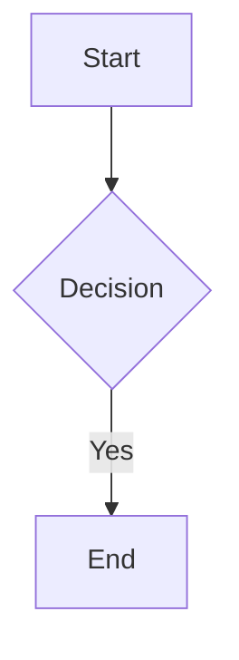

# Formatting, math, mermaid, footnotes

| Syntax | Result |
|--------|--------|
| `**bold**` | Bold |
| `*italic*` | Italic |
| `~~strikethrough~~` | Strikethrough |
| `==highlight==` | Highlight |
| `` `inline code` `` | Inline code |

Inline math: `$E = mc^2$`

Block math:

```markdown
$$
\int_0^\infty e^{-x} dx = 1
$$
```

Mermaid (Obsidian-native): `graph`, `sequenceDiagram`, `gantt`,
`classDiagram`, `pie`, `flowchart`.

````markdown

````

Footnote:

```markdown
This sentence has a footnote.[^1]

[^1]: The footnote text goes here.
```
