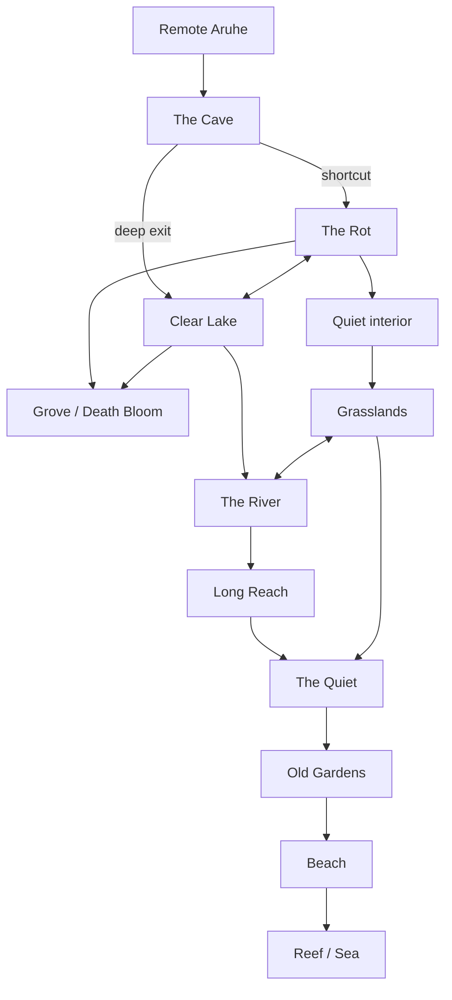

# Aruhe Wilderness Mega-Dungeon

> [!narration] Overview
> Five hundred miles of mute jungle wearing a garden's skin. One gap in a tooth-line reef. One short shingle beach. Terraces climb into fruit hanging too heavy, then canopy that does not stop — ridge behind ridge, no birdsong. A brighter seam inland is water. Roots under [[region.aruhe-the-rot|The Rot]] glow and all point the same way. Stop when they take the gap, the climb, the water-seam, or the hole under the roots.

![[assets/places/aruhe-2.jpeg]]

Playable topology for [[region.aruhe|Aruhe]]. Regions are levels. Landmarks are rooms. Game trails, rivers, caves, ridges, and root-roads are corridors. Local geography, ecology, and hazards stay on their owners; this page owns how those nodes connect and how an expedition moves.

Rescue pressure: [[situation.aruhes-hungry-isle|Aruhe's Hungry Isle]]. Garden intelligence: [[creature.blight|Hinewai]].

## Purpose

- **Original purpose:** [[creature.blight|Hinewai]] bound herself into the living ground so one grave would never change. The island is that vow at country scale.
- **Current state:** Nested pointcrawl. Geographic miles stay real; table time is decisions, discoveries, and consequences — not every mile walked. Soft gates, not level locks.
- **Hook:** Recover living castaways and get off alive. A later return may reach the Death Bloom. Neither is required by the map.

## Atmosphere

- **Signature:** A beautiful living system watching, classifying, and able to punish before anyone names the rule.
- **Lighting:** Beach glare and reef spray; terrace green-gloom; Quiet and Rot sealed canopy; Grassland and lake sudden noon; Cave ordinary darkness.
- **Recurring motif:** Familiar life doing its job too well — packs, still deer, tended water, roots that report.

## Key Features

- **Nested pointcrawl:**
  - **Obvious:** Bands from beach to grove, cut by river valleys and an under-level of lava tubes.
  - **Reveals:** Connectivity is playable, not proportional. The diagram below is routes, not a chart.
  - **Logic:** Regions = levels. Landmarks = rooms. Trails, rivers, caves, ridges, root-roads = corridors. Predator territories roam. Known refuges are safe rooms. Mapped shortcuts are secret doors. [[creature.blight|Hinewai]] is the dungeon intelligence. The Death Bloom is the final objective.
  - **Consequence:** Crossing the island is route choice. Local keys stay on the linked region and location pages.

- **Penetration tiers (soft gates):**
  - **Obvious:** Danger and wrongness thicken inland.
  - **Reveals:** Outer / Middle / Heart / Beyond. Never "you need level 10." Tracks, then evasion, then survival, then a chosen hunt.
  - **Logic:** Territory, visible consequence, and learned routes communicate when an approach is beyond current tolerance. Nothing physically bars a deeper walk.
  - **Consequence:** Outer [[region.aruhe|Aruhe]] can resolve as a complete rescue. Going farther is an expedition of choice.

| Tier | Nodes | Role |
|---|---|---|
| **Outer [[region.aruhe\|Aruhe]]** | [[region.aruhe-the-beach\|Beach]], [[region.aruhe-the-old-gardens\|Old Gardens]], [[region.aruhe-the-quiet\|Quiet]] edge | Complete rescue adventure |
| **Middle [[region.aruhe\|Aruhe]]** | Quiet, [[region.aruhe-the-grasslands\|Grasslands]], [[region.aruhe-the-river\|River]], [[location.aruhe-the-long-reach\|Long Reach]], Cave approaches | Mapping, ecosystem, shortcuts |
| **Heart [[region.aruhe\|Aruhe]]** | [[region.aruhe-the-rot\|Rot]], deep caves, [[location.aruhe-the-clear-lake\|Clear Lake]], [[region.aruhe-the-grove\|Grove]] | Assault on [[creature.blight\|Hinewai]] / Death Bloom |
| **Beyond corridor** | Rest of the 500-mile island | Makes [[region.aruhe\|Aruhe]] a place, not one adventure |

- **Expedition Turn:**
  - **Obvious:** Meaningful wilderness travel, not hourly hexes.
  - **Reveals:** One turn ≈ 4 hours. Two turns = a normal eight-hour travel day. Pushing past that uses ordinary forced-march / exhaustion.
  - **Logic:** Route → role choices → one resolution → consequence. Typical roles: Guide (Survival), Watch (Perception), Naturalist (Nature), Scout (Stealth), Quartermaster (Survival). Roll only when failure matters.
  - **Consequence:** Time, route change, discovery, exposure, lost resources, attracting fauna, or an encounter — not automatically combat. Local hazard procedures stay on their owners.

- **Routes are treasure:**
  - **Obvious:** First crossing of a band is expensive.
  - **Reveals:** Mapping permanently improves later expeditions.

| Route state | Effect |
|---|---|
| **Unknown** | Full travel cost; navigation risk |
| **Observed** | Destination known |
| **Mapped** | Navigation failure largely removed |
| **Mastered** | Travel compresses; known camp or refuge |
| **Shortcut discovered** | Bypasses one or more nodes |

- **Logic:** Wilderness equivalent of opening a barred door from the far side.
- **Consequence:** A level-15 return does not replay the level-5 climb. Mastery does not tame predators.

- **Regional 30-minute tables:**
  - **Obvious:** Local exploration has a smaller turn than island travel.
  - **Reveals:** A failed local route check rolls the table for the current region.
  - **Logic:** Use [[random-table.aruhe-beach-navigation|Beach]], [[random-table.aruhe-old-gardens-navigation|Old Gardens]], [[random-table.aruhe-quiet-navigation|Quiet]], [[random-table.aruhe-grasslands-navigation|Grasslands]], [[random-table.aruhe-river-navigation|River]], [[random-table.aruhe-cave-navigation|Cave]], [[random-table.aruhe-rot-navigation|Rot]], or [[random-table.aruhe-grove-navigation|Grove]] when play zooms below an Expedition Turn.
  - **Consequence:** Success finds the local way; failure gives a region-specific hazard, event, encounter, clue, or temptation.
- **Root-roads:**
  - **Obvious:** Luminous sap-lines in [[region.aruhe-the-rot|The Rot]] always point at [[region.aruhe-the-grove|The Grove]].
  - **Reveals:** You cannot get lost following them. [[region.aruhe-the-grove|The Grove]] knows you are coming.
  - **Logic:** Avoid = slow and stealthy. Cross = normal. Follow = dramatically faster. Travel math and local alerts: [[region.aruhe-the-rot|The Rot]].
  - **Consequence:** Fastest Heart approach is the loudest.

- **Honest high-level movement:**
  - **Obvious:** Flight, teleportation, *Transport via Plants*, divination, and other tier-3 tools work.
  - **Reveals:** They change which approaches are available. They do not delete ecology or [[region.aruhe-the-grove|The Grove]] as last room.
  - **Logic:** High-level movement is the reward for becoming able to use it.
  - **Consequence:** Design the strategic game so those spells matter instead of breaking the island.

## Room Index

Rooms that already have geography pages stay linked. Keys, DCs, and fauna procedures live there. This index is connectivity, first picture, and what the node is *for*.

### R1 — Reef / Beach

> [!narration] Entry Description
> Jagged reef a half-mile out. One gap. Then a short shingle beach you can walk end to end in minutes. A broken hull sits above the tideline. The swell never quite stops talking. Terrace stone starts at the vegetation line. Stop when they choose the gap, the wreck, or the climb.

- **Dimensions:** Charted western landing; the rest of the coast is not an approach. Full key: [[region.aruhe-the-beach|Aruhe Beach]].
- **Exits:** Reef gap → open water. First risers → R2. Wreck hull is a refuge on the sand.
- **Affordances:**
  - **Obvious:** Sole landing; visible retreat over the same gap.
  - **Reveals:** Birds watch. The tide and territorial hazards remain real.
  - **Logic:** Safe room / entrance / extraction. Learned reef navigation becomes mastered access on later landings.
  - **Consequence:** Outer expeditions can leave from here.
- **Typical presence:** [[creature.reef-skull|Reef Skulls]] at low tide; sharks in the gap; [[npc.sandro|Sandro]] and [[npc.nino|Nino]] in the hull while [[event.aruhe-wreck|The Aruhe Wreck]] aftermath is live. [[faction.grung-clans|Grung]] boats watch and will not land.

### R2 — Lower Old Gardens

> [!narration] Entry Description
> Dark wet stone climbs in broken steps. Flooded ditches sit between levels, still and green. Yam vines thick as a wrist and citrus the size of a fist hang in every gap. The air tastes of fruit gone sweet toward rot. Stop when they take a riser, a ditch, or a warren mouth.

- **Dimensions:** Several miles of broken elevation behind the beach. Full key: [[region.aruhe-the-old-gardens|The Old Gardens]].
- **Exits:** Down → R1. Three routes rejoin at R4. Up-tree-line → R5 / R6. [[location.aruhe-the-old-mouth|The Old Mouth]] → R10.
- **Affordances:** Temptation room, not a corridor.

| Route | Advantage | Cost |
|---|---|---|
| **Terrace stair** | Fast, obvious | Visible; [[creature.wolfrabbit\|Wolfrabbit]] / [[creature.vine-lash\|Vine Lash]] territory |
| **Flooded irrigation ditch** | Concealment | Water, footing, hidden drops |
| **Collapsed warrens** | Shortest | Cramped, unstable, inhabited |

- **Typical presence:** Wolfrabbit warrens in the walls; Vine Lash over the only climbs; feral fruit that actually heals. Plenty is not permission.

### R3 — Upper Gardens

> [!narration] Entry Description
> Cultivation narrows against the tree line. Fallen fruit lies where it dropped. Birds turn their heads toward anyone who picks. Stop when they watch, take, or keep climbing.

- **Dimensions:** Upper terrace band against Quiet canopy. Owned by [[region.aruhe-the-old-gardens|The Old Gardens]].
- **Exits:** Down the loop → R2 / R4. Tree line → R5.
- **Affordances:** Upper terraces against the tree line. Castaway testimony, if present, is [[situation.aruhes-hungry-isle|Aruhe's Hungry Isle]].
- **Typical presence:** Juvenile canopy hunters; [[creature.unsaid-macaw|Unsaid Macaws]] in the orchards.

### R4 — The Broken Terrace

> [!narration] Entry Description
> Open stone. Broken retaining walls. Several lines of sight. Warren mouths mark a claim. Stop when they wait, change routes, withdraw, or step onto the pack's ground.

- **Dimensions:** Upper route junction on [[region.aruhe-the-old-gardens|The Old Gardens]].
- **Exits:** Rejoin of stair / ditch / warrens. Up → R3. Down → R2.
- **Affordances:** Decision surface and territorial predator site. A fight is one possible choice, not the required resolution.
- **Typical presence:** [[creature.wolfrabbit|Wolfrabbit]] territory. Tonight's roster is Work.

### R5 — Quiet Edge

> [!narration] Entry Description
> Canopy closes. Birdsong is already gone. A game trail cuts inland, packed wide. A brighter river-seam shows once through the trunks. Stop when they take a trail, wait, or go back down the terraces.

- **Dimensions:** Tree line of [[region.aruhe-the-quiet|The Quiet]].
- **Exits:** Down → R3. Inland trails → R6. Valley seam → R7. Soft gate: rescue can end here.
- **Affordances:** Optional forbidden door. Nothing physically stops a deeper walk. Everything should communicate that the first expedition is complete if the crew has people and a route home.
- **Typical presence:** Mute birds; first [[creature.deer-stalker|Deer-Stalker]] sign; distant [[creature.bear-elk|Bear-Elk]] evidence.

### R6 — The Quiet

> [!narration] Entry Description
> Sight dies at a few paces. Leaves hang too large. No insects. A boot comes down and the jungle does not answer. Stop when they take a game trail, go off-trail, or hunt for water sound.

- **Dimensions:** Tens of miles of mute canopy. Full key: [[region.aruhe-the-quiet|The Quiet]].
- **Exits:** Gardens tree line → R5. Game trails / off-trail / river-seeking → R7, R8, or R11. Cave mouths → R10 ([[location.aruhe-the-daylight-hole|Daylight Hole]] is an emergency exit *from* the Cave).
- **Affordances:** Maze level. No visual landmarks. Read trails, claw marks, scat, bird gaze, water sound, canopy breaks. Three routes: game trail (fast, predator highway); off-trail (slow, fewer predictable hunters); river-seeking (hard to locate, opens the express network).
- **Typical presence:** Deer-Stalkers, Thornbacks, Strangler Figs, Crown Squids. Silence is surveillance.

### R7 — Grasslands

> [!narration] Entry Description
> The canopy tears open. A river has cut a valley of hard noon light. Eight-foot grass fills the floor. After the mute jungle the water is loud. Stop when they step into the light, follow the water, or stay under the trees.

- **Dimensions:** River-cut valleys, not a sixth band. Full key: [[region.aruhe-the-grasslands|The Grasslands]].
- **Exits:** Jungle walls → R6. Water → R8. Uphill cuts persist into R12.
- **Affordances:** Giant exposed chambers. Jungle trained them to fear what they cannot see; here everything at the rim can see them. Grass is difficult terrain and heavy obscurement. [[hazard.razer-grass|Razer-Grass]] is trapped floor tiles — discrete white patches, not a blanket biome.
- **Typical presence:** [[creature.terror-bird|Terror-Birds]] at the shaded rim; Deer-Stalkers in blades that do not lean with the wind.

### R8 — The River

> [!narration] Entry Description
> The jungle breaks on water. Green-blue current, cool enough to feel almost obscenely good. Pale stone under ten feet of clarity. No bones, no blood, no mist. Stop when they step in, watch the bank, or keep walking the grass.

- **Dimensions:** Lateral artery across bands. Full key: [[region.aruhe-the-river|The River]].
- **Exits:** Downstream Quiet / Grasslands. Uphill → R9 then R13. Jungle bank / grass bank are different exposures. Flooded cave links toward R10 are possible, not guaranteed.
- **Affordances:** Express route. On foot: days. By water: hours. The route belongs to the otters. Fast-dangerous vs slow-exhausting is the choice.
- **Typical presence:** [[creature.aruhe-river-otter|The Family]]. Bank predators as on R7 / R6.

### R9 — Long Reach

> [!narration] Entry Description
> The river widens over white limestone. Silver fish flash. Otters surface thirty feet out, hold hands, chirrup. Something tugs a trailing rope. Stop when they step in, drink, or watch the far bank.

- **Dimensions:** Two to three miles of broad, slow water. Full key: [[location.aruhe-the-long-reach|The Long Reach]].
- **Exits:** Channel continues R8. Banks → R6 / R7.
- **Affordances:** Social/predator puzzle, not a scheduled fight. Watch → gear → reaction test → grapple → hunt switch. Learning the animals is safer than defeating them.
- **Typical presence:** One Family unit; Deer-Stalker heads as play.

### R10 — The Cave

> [!narration] Entry Description
> Black stone curves down in a tube wide enough to walk three abreast. Roots hang in pale curtains. Thirty feet in, daylight is a grey disc. Fifty feet in, it is gone. Somewhere ahead, something strikes the stone. Stop when they mark the wall, continue downhill, or turn around.

- **Dimensions:** Volcanic under-level, not one hallway under 500 miles. Full key: [[region.aruhe-the-cave|The Cave]]. Landmarks: [[location.aruhe-the-old-mouth|Old Mouth]], [[location.aruhe-the-daylight-hole|Daylight Hole]], [[location.aruhe-the-great-bore|Great Bore]], [[location.aruhe-the-drowned-tube|Drowned Tube]].
- **Exits:** Old Mouth ↔ R2. Daylight Hole → R6 (exit, not safety). Rot mouths → R12. Possible Quiet⇄Rot and River⇄Lake shortcuts; no cave door to R14.
- **Affordances:** Sublevel. Discontinuous connections. Surface costs navigation, predators, surveillance. Cave costs darkness, collapse, dead air, and [[creature.blackrail|Blackrail]]. Never universally better.
- **Typical presence:** Blackrail on main tubes; environmental hazards on the cave pages.

### R11 — Quiet / Rot boundary

> [!narration] Entry Description
> Chest-high claw scores. Sap on the bark glows faintly after dark. The air ahead tastes of spore. Stop when they wait, time the gap, take another approach, or step onto the circuit.

- **Dimensions:** Each known Quiet→Rot approach has its own scored loop. Owned by [[region.aruhe-the-quiet|The Quiet]] and [[region.aruhe-the-rot|The Rot]].
- **Exits:** Back → R6. Inland → R12. Cave bypass → R10.
- **Affordances:** Schedule, not a locked door. Low-level hides. Mid-level times the 4-hour circuit. High-level chooses whether fighting is worth alerting the island.
- **Typical presence:** One [[creature.bear-elk|Bear-Elk]] per known corridor.

### R12 — The Rot

> [!narration] Entry Description
> Daylight barely reaches the floor. Every leaf is black at the edge. Exposed roots thread luminous sap upslope. The air tastes of spore and unfinished rot. Stop when they step over a root, follow it, or turn back.

- **Dimensions:** Inner highland jungle. Full key: [[region.aruhe-the-rot|The Rot]].
- **Exits:** Boundary → R11. Root-roads / trails → R13 and R14. Cave mouths → R10. Sicker grassland cuts → R7.
- **Affordances:** Attrition level. Growth with the brakes off. Corrupted Air: DC 14 Constitution at the end of each unprotected Expedition Turn, and after intense spore exposure; filtration, magic, safe groves, or confirmed-safe cave routes negate the routine check.
- **Typical presence:** [[creature.corpsewood|Corpsewood]], [[creature.terror-bird|Terror-Birds]], [[creature.silence-moths|Silence Moths]]. Root-roads as above.

### R13 — Clear Lake

> [!narration] Entry Description
> The jungle breaks on pale stone. A wide lake holds the sky twice. Gin-clear over white shelves. A green shelf hangs above one shore, fruit-sweet. Streams leave the stone downhill. Stop when they drink, stare down, climb the shelf, or keep to the Rot.

- **Dimensions:** Highland basin in inner Rot. Full key: [[location.aruhe-the-clear-lake|The Clear Lake]].
- **Exits:** River upstream/down → R8. Rot trails and root-roads → R12. Cave exits under the highlands → R10. Grove shelf → R14 (climbing down from the Grove is leaving the last room, not a second door in).
- **Affordances:** Central hub before the boss. After Rot claustrophobia: sky, open water, silence, beauty. Then the association with grief. Arriving here does not force the climb.
- **Typical presence:** Watering-hole traffic; lake-facing Bear-Elk loops.

### R14 — The Grove

> [!narration] Entry Description
> Luminous roots end in a clearing too green for the air around it. A fruit tree stands over two unmarked graves. Black flowers ring the grass. Fauna gather at the boundary and do not hunt. Stop when they step to the graves, touch the fruit, or turn back into the Rot.

- **Dimensions:** 100–150 ft memorial, not another biome. Full key: [[region.aruhe-the-grove|The Grove]].
- **Exits:** Out is back through R12. Lakeward shelf looks onto R13; it is not a second door. No cave entrance.
- **Affordances:** Final room. Everywhere else, life moves too much. Here nothing changes. The Death Bloom is graves, tree, ring, soil, and ritual — not a pocketed object. Body HP is not the objective. Bloom states and staged chassis live on the Grove and [[creature.blight|Hinewai]].
- **Typical presence:** Mourner line at the tree line. Hinewai stays offstage until this room.

### R15 — Remote Aruhe

> [!narration] Entry Description
> Past the known western system the mute country keeps going. Ridge behind ridge. No charted gap. Stop when they mark a new node, turn back along a mastered route, or admit they have left the expedition they came for.

- **Dimensions:** The rest of the 500 × 150 mile island.
- **Exits:** Unknown future nodes. Cave systems that are not the interconnected western/central set.
- **Affordances:** Beyond corridor. Makes Aruhe a place rather than one adventure. Do not invent a second heart.
- **Typical presence:** Source is silent on named landmarks.

## Faction Presence

- [[faction.grung-clans|Grung Clans]] — inherited enemy of this sand. Patrol the western reefs. Will not land. Attacked on sight by the garden. They are a coastal constraint, not an interior faction.

No other faction holds ground on the island. [[creature.blight|Hinewai]] is the intelligence, not a faction.

## Secrets

> [!secret]- Dungeon Secrets
> [[creature.blight|Hinewai]] is present long before combat: silent birds, independent fauna, roots that report. She is not omniscient and does not puppet animals.
>
> Required conclusions need at least three clues (survivors, bird reaction; river engineering, fruit, roots; spared defenders, protected nests; preserved objects, flower boundaries, lake evidence; root direction, animal behavior, stories; Rot anatomy, Grove interaction, her reaction). Portable secrets, not one corpse or one check.
>
> She once lost the one thing she could not replace. The island is not malfunctioning. It is functioning as its wounded creator intended.
>
> Destroying the Death Bloom ends her permanently and starts ecological release. Leaving it preserves the sanctuary and its killings. Bargaining is a live approach. None of these is a scripted victory.

## Treasure

Do not primarily reward Aruhe with loot stolen from Aruhe. Reward knowledge and access.

| Reward | Future value | Owner |
|---|---|---|
| Reef navigation | Advantaged later landing | [[region.aruhe-the-beach\|Beach]] |
| Garden route map | Skip early navigation | [[region.aruhe-the-old-gardens\|Old Gardens]] |
| Survivor account | What the wreck and inland people know | [[situation.aruhes-hungry-isle\|Hungry Isle]] |
| Predator observations | Plan around known species | creature pages |
| Quiet trail / river heading | Opens middle island | [[region.aruhe-the-quiet\|Quiet]], [[region.aruhe-the-river\|River]] |
| Cave connection | Skip-level shortcut | [[region.aruhe-the-cave\|Cave]] |
| Miracle fruit | Real consumables | [[region.aruhe\|Aruhe]] catalogue |

## Resolution

- **Place change:** If the Death Bloom is destroyed, Aruhe does not become ordinary jungle overnight. Weeks: root coordination stops. Months: territories shift. Years: populations crash, migrate, compete, and normalize. Some species survive, some vanish, some leave. The River changes. The Quiet slowly acquires sound. Fruit overripens and falls. Detail: [[region.aruhe-the-grove|The Grove]].
- **If preserved:** Return visits look almost identical. Same ripe fruit, same open flowers, same graves, same waiting mourners.
- **Loose threads:** Remote Aruhe; any unmapped cave shortcut; whether [[npc.nona-black-jaw|Nona]]'s survey can ever use this landing; the captive trail owned by [[situation.the-aruhe-rescue|The Aruhe Rescue]].
